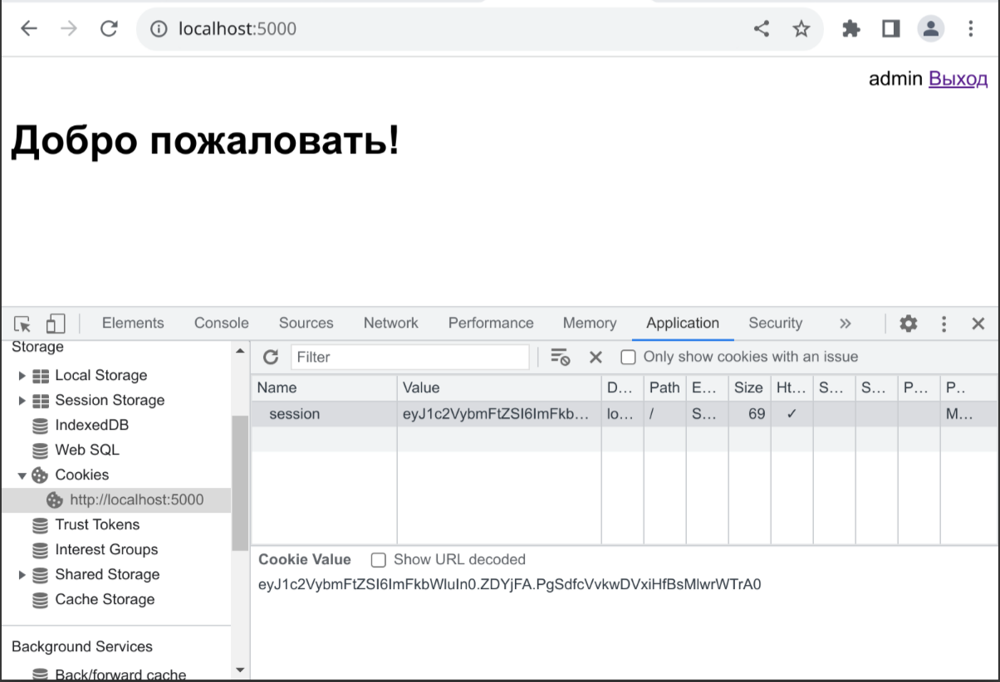

# Flask-4

## Предварительные шаги

1. Откройте каталог проекта в редакторе VS Code

2. Создайте и активируйте виртуальное окружение 

Powershell:

```powershell
py -m venv venv
venv\scripts\activate.ps1
```

Командная строка:

```cmd
py -m venv venv
venv\scripts\activate.bat
```

3. Установите библиотеки используя список из `requirements.txt`:

```powershell
pip install -r requirements.txt
```

4. Инициализируйте базу данных:

```powershell
flask db init
flask db migrate -m "Initial migration"
flask db upgrade
```

5. Разрешите отладку и запустите веб-сервер разработчика:

Powershell:

```powershell
$ENV:FLASK_DEBUG=1
flask run
```

Командная строка:

```cmd
set FLASK_DEBUG=1
flask run
```

## Сессии

1. Добавьте страницу аутентификации

  a. Добавьте шаблон `login.html`:

```html



<h1>Вход на сайт</h1>
<form method="post">

    <div class="row">
        <label>Логин</label>
        <input type="text" name="username" value="{{ username }}">
    </div>

    <div class="row">
        <label>Пароль</label>
        <input type="password" name="password">
    </div>

    <div class="row">
        <input type="submit" value="Войти">
        <a href="{{ url_for('index_page') }}">Отмена</a>
    </div>
</form>

```

  b. Добавьте функцию `login_page()`:

```python
def login_page():
    username = ""
    if request.method == "POST":
        username = request.form.get("username")
        password = request.form.get("password")
        if username == "admin" and password == "pass":
            session["username"] = username
            return redirect(url_for("index_page"))
    return render_template("login.html", username=username)
```

  c. Добавьте функцию `logout()`:

```python
def logout():
    session.pop("username")
    return redirect(url_for("index_page"))
```

  d. Добавьте секретный ключ (для шифрования данных сессии) в `create_app()`:

```python
app.config["SECRET_KEY"] = "secret"
```

  e. Добавьте соответствующие правила для URL в `create_app()`:

```python
app.add_url_rule("/login/", view_func=views.login_page, methods=["GET", "POST"])
app.add_url_rule("/logout/", view_func=views.logout)
```

  f. Добавьте в базовый шаблон навигационную панель

2. Проверьте работу механизма аутентификации

3. Удалите Cookie и проверьте что это приводит к очистке данных сессии:



4. Сделайте коммит

## Проверка данных и обработка ошибок

Исправьте страницу аутентификации.

Проверьте работу.

Сделайте коммит.

## Создание админки

Установите расширение `Flask-Admin`.

Добавьте ссылку на админку.

Проверьте работу.

Сделайте коммит.

## Создание связей между таблицами

Создайте новую таблицу .

Проверьте работу.

Сделайте коммит.

## Ссылки

* [Документация Flask](https://flask.palletsprojects.com/)
* [Документация Flask-SqlAlchemy](https://flask-sqlalchemy.palletsprojects.com/)
* [Документация Flask-Migrate](https://flask.palletsprojects.com/)
* [Документация Flask-Admin](https://flask-admin.readthedocs.io/)
* [Документация SqlAlchemy](https://www.sqlalchemy.org/)
* [Документация Alembic](https://alembic.sqlalchemy.org/)
